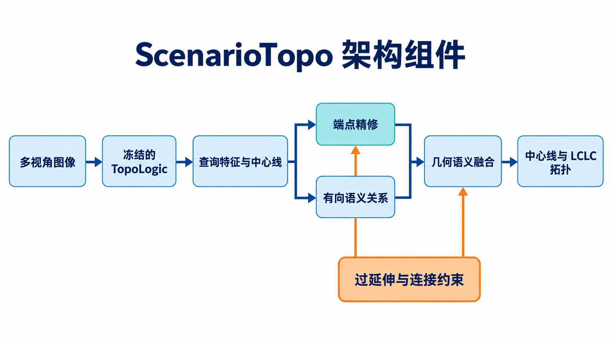

# ScenarioTopo：中心线端点与拓扑联合优化

本项目以 [OpenLane-V2 subset A](https://github.com/OpenDriveLab/OpenLane-V2) 为公开数据，使用冻结的 [TopoLogic](https://github.com/Franpin/TopoLogic) 感知模型，研究两个相互关联的问题：**中心线终点过度延伸**与**有向车道连接错误**。当前远端实例没有可用 GPU；数据、评测、轻量模型与 CPU 测试已准备好，真实模型推理和训练尚未运行。

## 架构组件



输入是多视角图像。TopoLogic 生成查询特征和中心线；端点精修与有向语义关系分别提供几何和语义信息，融合后输出中心线及 LCLC 有向拓扑。过延伸与连接约束用于训练。图由图像生成工具绘制，模块和箭头仅表示数据流，不代表已完成 GPU 训练。

## 数据来源与当前状态

| 资源 | 用途与来源 | 远端状态 |
| --- | --- | --- |
| OpenLane-V2 subset A | 官方 `lane_centerline` 三维点、`topology_lclc` 有向邻接矩阵及相机标定；标注来自 OpenLane-V2 发布包 | 已提取到 `/root/autodl-tmp/datasets/openlanev2/OpenLane-V2`；原始标注包校验 MD5 后已移除，保留解压数据 |
| Argoverse 2 Sensor 图像 | AutoDL 公共数据挂载 `/root/autodl-pub/argoverse2.0-sensor`；这是图像来源，**不包含** OpenLane-V2 的拓扑标注 | 原始 val 划分的 4,806 帧、33,642 张图像（每帧 7 路相机）已按需提取，提取报告为零缺失；训练图像仍保留在只读 tar 分片中 |
| TopoLogic 源码与官方 checkpoint | 冻结感知主干、查询特征及原始拓扑分数的来源 | 源码已固定在 `c7b37f7`；checkpoint 位于 `/root/autodl-tmp/checkpoints/topologic_r50_8x1_24e_olv2_subset_A.pth` |
| OpenLane-V2 devkit | 数据预处理和后续官方评测 | 固定为 `v2.1.0`，提交 `d731a26` |

目前**没有使用 SD Map**。后续若做地图消融，需单独准备地图输入，并保持无地图基线可比较。数据与 checkpoint 不纳入 Git 仓库；校验值和来源见 [复现锁定信息](docs/LOCKS.md)，图像提取方法见 [数据准备说明](docs/DATA_PREP.md)。

## 数据分布

以下数字由远端已校验的 `results/openlanev2_geo_split.jsonl` 流式统计，统计日期为 2026-09-24。原始 OpenLane-V2 subset A 共 **32,099 帧**，其中 4,816 帧基准测试集没有公开标注；其余 **27,283 帧有标注**。项目在有标注数据上建立了隔离物理场景的工作划分，校验报告没有重复帧、缺失标注文件或跨划分物理场景泄漏。

可运行 `python tools/report_data_distribution.py --manifest results/openlanev2_geo_split.jsonl` 重新生成分布统计。

| 划分 | 原始数据帧数 | 项目工作划分帧数 | 工作划分占全部帧 |
| --- | ---: | ---: | ---: |
| 训练 | 22,477 | 21,846 | 68.1% |
| 验证 | 4,806 | 2,718 | 8.5% |
| 留出测试 | — | 2,719 | 8.5% |
| 无标签基准测试 | 4,816 | 4,816 | 15.0% |

“原始数据帧数”指 `data_dict_subset_A.json` 的 train/val/test；“项目工作划分”是用于本项目实验的地理隔离划分，二者不能混用。无标签基准测试帧不能计算 GT 拓扑或终点误差。

在 **27,283 个有标注帧**中，每帧中心线数量：中位数 **27**，四分位区间 **18–34**，最大 **83**；每帧 GT 有向 LCLC 边数：中位数 **25**，四分位区间 **16–33**，最大 **89**。

| 启发式场景标签 | 命中帧数 | 占有标注帧 |
| --- | ---: | ---: |
| Split（存在分流） | 25,698 | 94.2% |
| Merge（存在合流） | 25,242 | 92.5% |
| ComplexJunction（复杂连接） | 21,713 | 79.6% |
| SparsePositive（连接稀少） | 1,172 | 4.3% |
| ElevationOverlap（高度重叠） | 45 | 0.2% |

这些标签由 [场景规则](src/scenariotopo/data/scene_tags.py) 自动产生，**同一帧可以有多个标签**。Split/Merge 的规则是帧内至少一条车道满足度数阈值，因此表中比例是“包含该结构的帧比例”，不是车道或端点比例，也不是官方场景类别分布。训练端点的连接段、分流、合流分桶另按 GT 车道边界计算。

## 环境与额外依赖

**当前 CPU 环境已安装**：Python 3.10.8、NumPy 1.23.5、PyYAML 6.0.2、pytest 8.3.5、PyTorch 2.1.2+cpu。依赖定义见 [requirements-cpu.txt](requirements-cpu.txt)、[requirements-model-cpu.txt](requirements-model-cpu.txt)。远端可用路径为 `/root/autodl-tmp/envs/scenariotopo`；实例内存限额 **2 GiB**，数据盘 **50 GiB**，检查时约 **29 GiB** 可用。

**真实 TopoLogic 推理仍需** NVIDIA GPU 和独立的旧版环境。TopoLogic 官方列出 Linux、Python 3.8.x、CUDA 11.1、PyTorch 1.9.1；其固定 `requirements.txt` 还包含 `openlanev2==2.1.0`、`mmcv-full==1.5.2`、`mmdet==2.26.0`、`mmsegmentation==0.29.1`、`mmdet3d==1.0.0rc6` 等。当前 CPU 虚拟环境**不能直接替代**该 GPU 环境。检查入口见 [GPU 交接说明](docs/GPU_HANDOFF.md)。

训练相机图像也没有全部解包：AutoDL 的 AV2 分片总量远超 50 GiB 数据盘。GPU 阶段应按训练分片逐个提取、导出冻结特征并清理本次提取的图像；已生成的相机请求索引有 **190,981 条**。不要把原始数据、checkpoint 或特征缓存推入 Git。

## 已实现的 CPU 侧工作

- 流式构建数据清单、结构标签和地理隔离划分，并验证数据完整性。
- 对 GT 匹配查询计算前驱/后继集合完全正确率、图边 Precision/Recall/F1、帧级拓扑通过率；按连接段、分流、合流端点统计纵向过延伸代理指标。
- 提供平滑端点精修、纵向过延伸与过渡边界损失、几何语义拓扑头和困难负样本排序损失。
- 提供纯 CPU 的距离/航向拓扑探针与“替换为 GT 端点”的 oracle；oracle 只用于定位误差来源。
- 提供 `baseline`、`endpoint`、`overshoot`、`transition`、`hybrid`、`full` 配置及合成缓存测试。

```bash
cd /root/autodl-tmp/ScenarioTopo
source tools/env.sh
python tools/check_resources.py
python tools/validate_data.py \
  --manifest results/openlanev2_geo_split.jsonl \
  --data-root "$OPENLANEV2_ROOT"
pytest -q
```

当前干净 Git 导出目录内 **16 项测试通过**；合成缓存已验证训练和评测入口。**合成结果不是 OpenLane-V2 实验结果。**真实实验必须先在 GPU 上运行官方 checkpoint，缓存查询特征、中心线、置信度、原始 LCLC 分数及一对一 GT 匹配，再运行上述消融。缓存字段要求见 [GPU 交接说明](docs/GPU_HANDOFF.md)。

## 评测边界

当前自定义拓扑指标只统计 **GT 匹配到的查询**，不能代替完整检测器指标或 OpenLane-V2 官方 `TOP_ll`。当前“过渡区侵入率”根据 GT 端点切向量和连接段/分合流标签计算纵向越界，属于**代理指标**，不能宣称等同于公司的区域级 P1 失败率。定义详见 [指标说明](docs/METRICS.md)。
