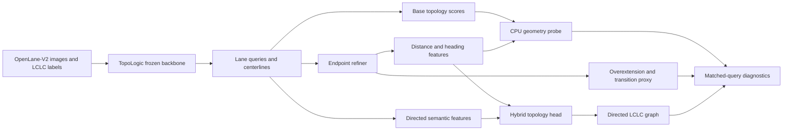

# ScenarioTopo

Scenario-driven endpoint and lane-topology optimization on OpenLane-V2 with a
frozen TopoLogic perception backbone.

## Architecture components



The current CPU machine prepares labels, manifests, model heads, losses and
evaluation code. Frozen TopoLogic features and real model results require a GPU
export run. See [GPU hand-off](docs/GPU_HANDOFF.md).

This repository separates the work into two reproducible stages:

1. **CPU/data stage** — AutoDL Hub provenance, streaming scene manifests,
   structure tags, geographic leakage prevention, scenario-balanced weights,
   standalone endpoint and hybrid topology modules, and unit tests.
2. **GPU stage** — official TopoLogic checkpoint reproduction, frozen feature
   caching, head-only training, sliced evaluation, and ablations.

The current machine is intentionally used only for stage 1.  It has a 2GB
cgroup memory limit and no GPU, so all scripts default to one thread and zero
dataloader workers.

## Pinned upstream sources

- OpenLane-V2 devkit: tag `v2.1.0`, commit
  `d731a26bdbf34723dd915ad525c2c2eca19ed8a1`
- TopoLogic: commit `c7b37f73bc1b92ac8646351a9c63e86a5d74e8c8`
- Camera source: AutoDL Public Data / AutoDL Hub `argoverse2.0-sensor`
- Topology annotations: official OpenLane-V2 subset-A `info.tar`, verified by
  the official MD5 (the Hub AV2 item contains raw sensors, not OpenLane labels)

The official checkpoint fingerprint is recorded in
[docs/LOCKS.md](docs/LOCKS.md).

The TopoLogic repository reports results using mixed OpenLane metric versions;
new experiments must use the pinned OpenLane-V2 v2.1.0 devkit consistently.

## Layout

```text
ScenarioTopo/
├── configs/                  experiment and data thresholds
├── docs/                     data provenance and GPU hand-off
├── src/scenariotopo/
│   ├── data/                 streaming manifests, tags, geo splits
│   ├── evaluation/           per-scene topology metrics
│   ├── losses/               relation, endpoint, connection, ranking losses
│   ├── models/               endpoint refiner and learned hybrid head
│   └── samplers/             scenario/difficulty-aware weighting
├── tests/                    synthetic smoke tests (never reported as metrics)
└── tools/                    bootstrap and reproducible entry points
```

## CPU setup

```bash
cd /root/autodl-tmp/ScenarioTopo
bash tools/bootstrap_cpu.sh
source tools/env.sh
python tools/check_resources.py
pytest
```

Optional CPU PyTorch is installed only to test the model/loss modules:

```bash
bash tools/install_cpu_torch.sh
pytest
```

## Data

Follow [docs/DATA_PREP.md](docs/DATA_PREP.md).  Synthetic fixtures are only
unit-test inputs and must never be presented as OpenLane-V2 experimental
results.

## Cached-head experiments

After GPU feature export, each cache frame must contain lane query features,
predicted centerlines, confidences, a one-to-one query-to-GT assignment, and
GT LCLC adjacency. `FeatureCacheWriter` adds GT endpoints, end tangents,
transition-boundary tags and the matched-query adjacency. Include official
topology probabilities as `base_topology_scores` to run B0 and the CPU
distance/heading probe. The distance/heading rule is a transparent diagnostic,
not an exact implementation of TopoLogic's learned topology head.

```bash
python tools/evaluate_geometry_oracles.py \
  --index /path/to/cache/index.jsonl --split val \
  --output results/geometry_oracles.json
python tools/evaluate_cached_heads.py \
  --config configs/baseline.yaml --index /path/to/cache/index.jsonl \
  --split val --output results/baseline_eval.json
python tools/train_cached_heads.py \
  --config configs/full.yaml --index /path/to/cache/index.jsonl \
  --output results/full.pt --device cuda
```

`baseline.yaml` is evaluation-only. `endpoint.yaml` trains the endpoint
refiner with cached base topology scores; `hybrid.yaml` trains the relation
head; `full.yaml` combines the two. All topology exactness and frame-pass
numbers apply only to GT-matched queries. The transition penetration rate is
a longitudinal boundary proxy based on connector/split/merge labels, not a
measured intersection polygon intrusion rate. See
[metric definitions](docs/METRICS.md).

## Stop condition

After the real annotations, Hub validation images, and compact training-shard
request index validate, the next step is TopoLogic visual feature export.  At
that exact boundary, follow
[docs/GPU_HANDOFF.md](docs/GPU_HANDOFF.md) and start a GPU-backed instance.
