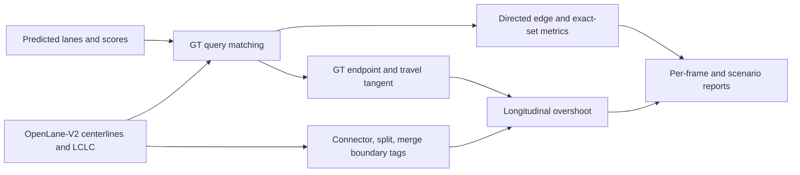

# Research metric definitions

All graph metrics use only GT-matched queries and exclude self edges. A
successor (predecessor) is exact if its entire directed matched-query neighbor
set equals GT. Frame topology pass requires all evaluable directed pairs to be
correct. Frames without matched queries do not enter frame-pass denominators.
These diagnostics do not count missed GT lanes, false lane detections or
official OpenLane-V2 TOP_ll ranking behavior.

For each matched endpoint, positive longitudinal error is
`max(0, dot(predicted_end - gt_end, unit_GT_end_tangent))`. Overshoot uses a
configurable margin, 0.5 m by default. The training loss uses
`max(0, longitudinal_error - margin)`. A transition boundary is tagged when a
non-connector lane leads into an official connector/intersection lane, its
out-degree exceeds one, or it leads into a merge successor. Transition
penetration is the share of these boundaries that overshoot the GT end by the
configured margin. This is a proxy for region intrusion: OpenLane-V2 subset A
does not supply an exact polygon for the company's P1 rule. Report the proxy
by name and never call it the company failure rate.
Endpoint reports include endpoint-level Connector, Split, Merge and Ordinary
buckets. Connector/Split/Merge may overlap when a boundary has several roles.

The geometry oracle replaces matched predicted start and end positions with
GT positions before recomputing distance/heading scores. It deliberately uses
GT at evaluation time to isolate endpoint sensitivity. It is not a deployable
model score.
